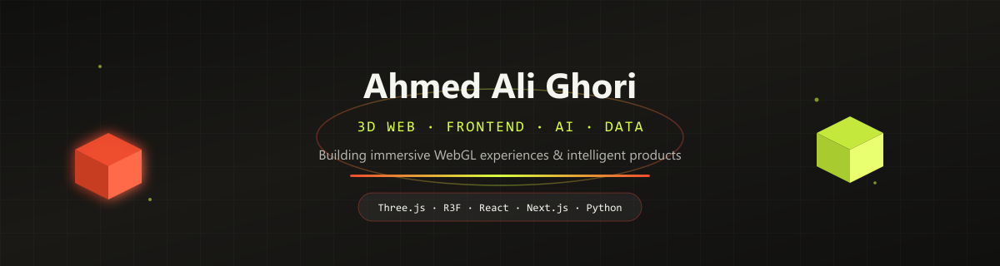

<!--
  Ahmed Ali Ghori - GitHub profile README
  All artwork is stored locally in this repository for reliable rendering.
-->

  

<h1 align="center">Ahmed Ali Ghori</h1>

  <strong>Immersive Frontend Developer</strong> 
  I build cinematic, responsive web experiences with WebGL, React, and purposeful motion.

  <a href="#selected-work">Selected work</a> &middot;
  <a href="https://www.linkedin.com/in/ahmed-ali-ghori-85a24b338">LinkedIn</a> &middot;
  <a href="mailto:ahmed@plantpot.studio">Email</a>

  Hyderabad, Pakistan &middot; Available for freelance and collaborative work

---

## Selected work

### 01 / Webgel Studio

A 16-page creative studio experience where WebGL heroes, smooth-scroll choreography, page transitions, and grain-driven art direction work as one visual system.

`Three.js` `GSAP` `Lenis` `WebGL`

[Explore the repository](https://github.com/AHMEDALIGHORI/Webgel-Studio-WEBGEL)

### 02 / PlantPot Studio

An explorable 3D portfolio built as a miniature world, combining React Three Fiber, animated environments, orbit controls, and scene-led navigation.

`Next.js` `React Three Fiber` `Drei` `TypeScript`

[Explore the repository](https://github.com/AHMEDALIGHORI/PlantPot)

### 03 / Qitchen

A responsive restaurant experience shaped through cinematic food imagery, restrained typography, and motion that supports the dining narrative.

`HTML` `CSS` `Responsive UI` `Motion Design`

[View the live experience](https://qitchen-animated-restaurant-website.vercel.app) &middot; [Explore the repository](https://github.com/AHMEDALIGHORI/qitchen-animated-restaurant-website)

---

## What I build

- **Immersive interfaces** with Three.js, WebGL, and React Three Fiber
- **Motion-rich product experiences** with GSAP, Framer Motion, and Lenis
- **AI-enabled prototypes** with Python, OpenCV, RAG, Firebase, and Gemini
- **Production-ready frontends** with responsive systems, clear documentation, and deployable builds

**Core toolkit:** React &middot; Next.js &middot; TypeScript &middot; Three.js &middot; R3F &middot; GSAP &middot; Tailwind CSS &middot; Python &middot; OpenCV

---

## More from the lab

- **[FIFA World](https://github.com/AHMEDALIGHORI/FIFA-WORLD-WEBSITE-)** - A tactile World Cup sticker album with scratch-to-reveal cards, WebGL motion, and liquid-glass feedback.
- **[Ahmed Ali Portfolio](https://ahmed-ali-portfolio-amber.vercel.app)** - A live motion portfolio with a video hero and scroll-directed storytelling. [Source](https://github.com/AHMEDALIGHORI/ahmed-ali-portfolio)
- **[VisionAI Pro](https://github.com/AHMEDALIGHORI/VisionAi-)** - Real-time computer-vision experiments for product recognition, gestures, and sign-language input.
- **[MindScope RAG](https://github.com/AHMEDALIGHORI/mindscope-emotion-screen-detection-rag)** - An emotion-screening and local RAG prototype built with React, Flask, and OpenCV.
- **[Noor Al-Huda](https://github.com/AHMEDALIGHORI/Noor-AL-Huda)** - An AI-assisted Islamic knowledge platform using React, Firebase, and Gemini.

---

## Let's make something memorable

Have a product that should feel as good as it works? I am available for immersive websites, interactive portfolios, product launches, and creative frontend collaborations.

  <a href="mailto:ahmed@plantpot.studio"><strong>Start a conversation</strong></a>
  &nbsp;&nbsp;&middot;&nbsp;&nbsp;
  <a href="https://www.linkedin.com/in/ahmed-ali-ghori-85a24b338">Connect on LinkedIn</a>

  Built with native Markdown and repository-owned artwork for fast, reliable rendering.

  

