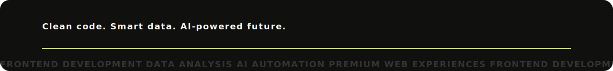

  

<h1 align="center">Ahmed Ali Ghori</h1>

  <strong>3D Frontend Developer & Data Analyst</strong> — crafting immersive WebGL worlds, animated product sites, AI tools, and data dashboards.

  

  
  
  
  
  

---

## What I Build

I build polished web experiences with a practical product mindset: responsive layouts, smooth motion, clear UI systems, useful AI/data workflows, and **interactive 3D interfaces people remember**.

| Focus | What I ship |
| --- | --- |
| **3D web** | WebGL heroes, R3F dioramas, orbit scenes, scroll-synced motion, portfolio worlds |
| **Frontend websites** | Landing pages, portfolios, restaurant sites, ecommerce concepts, cinematic clones |
| **AI tools** | Chatbot interfaces, RAG prototypes, computer vision apps, automation workflows |
| **Data products** | Dashboards, reports, insight panels, structured analysis interfaces |
| **Product demos** | Vercel-ready prototypes with clean README docs and local run steps |

---

## 3D Contribution Graph

  

---

## Flagship Projects

<table>
<tr>
<td width="50%" valign="top">

### 🌐 [Webgel Studio](https://github.com/AHMEDALIGHORI/Webgel-Studio-WEBGEL)
**Three.js · GSAP · Lenis · WebGL**

Sixteen-page cinematic studio clone with scroll choreography, WebGL heroes, page transitions, and film-grain overlays.

 

</td>
<td width="50%" valign="top">

### ⚽ [FIFA World Website](https://github.com/AHMEDALIGHORI/FIFA-WORLD-WEBSITE-)
**React 19 · Vite 6 · WebGL**

World Cup sticker album clone with scratch-to-reveal cards, WebGL animations, and liquid-glass hover layers.

 

</td>
</tr>
<tr>
<td width="50%" valign="top">

### 🪴 [Plantpot Studio Clone](https://github.com/AHMEDALIGHORI/PLANTPOT)
**Next.js · R3F · Drei**

Interactive 3D diorama portfolio with orbit controls, animated gradient sky, dark mode, and scene navigation.

 

</td>
<td width="50%" valign="top">

### 🍣 [Qitchen Restaurant](https://github.com/AHMEDALIGHORI/qitchen-animated-restaurant-website)
**HTML · CSS · Motion**

Cinematic sushi restaurant site with responsive pages, generated food imagery, and CSS motion design.

 

</td>
</tr>
<tr>
<td width="50%" valign="top">

### 🎬 [Ahmed Ali Portfolio](https://github.com/AHMEDALIGHORI/ahmed-ali-portfolio)
**React · GSAP · Framer Motion**

Dark motion portfolio with video hero, scroll-driven animation, and responsive product-style sections.

 

</td>
<td width="50%" valign="top">

### 👁️ [VisionAI Pro](https://github.com/AHMEDALIGHORI/VisionAi-)
**OpenCV · MediaPipe · YOLOv8**

Real-time computer vision for product recognition, gestures, and sign-language experiments.

 

</td>
</tr>
<tr>
<td width="50%" valign="top">

### 🧠 [MindScope RAG](https://github.com/AHMEDALIGHORI/mindscope-emotion-screen-detection-rag)
**Flask · React · ML · RAG**

Emotion-screening prototype with OpenCV cues, model ensemble, and local RAG recommendations.

 

</td>
<td width="50%" valign="top">

### 🕌 [Noor Al-Huda](https://github.com/AHMEDALIGHORI/Noor-AL-Huda)
**React · Firebase · Gemini**

Islamic knowledge platform with stories, Quran science pages, and AI chat flows.

 

</td>
</tr>
</table>

---

## Tech Stack

  

| Area | Tools |
| --- | --- |
| **3D Web** | Three.js, React Three Fiber, Drei, WebGL, Blender workflows |
| **Frontend** | HTML, CSS, JavaScript, TypeScript, React, Next.js, Vite, Tailwind CSS |
| **Motion/UI** | GSAP, Framer Motion, Lenis, scroll systems, micro-interactions |
| **Backend/Data** | Node.js, Express, Firebase, Python, Flask, dashboards, reporting flows |
| **AI** | Prompt engineering, RAG concepts, OpenCV, MediaPipe, model-backed prototypes |
| **Deployment** | Vercel, GitHub Pages, static hosting, project documentation |

---

## Current Direction

Every repo should answer three questions quickly:

- **What does it do?**
- **Why is it useful?**
- **How can someone run or learn from it?**

I'm focused on turning projects into finished public case studies with screenshots, live demos, setup instructions, useful descriptions, and searchable topics.

---

## GitHub Analytics

  
  
  

  

  <picture>
    <source media="(prefers-color-scheme: dark)" srcset="https://raw.githubusercontent.com/AHMEDALIGHORI/AHMEDALIGHORI/output/github-contribution-grid-snake-dark.svg">
    <source media="(prefers-color-scheme: light)" srcset="https://raw.githubusercontent.com/AHMEDALIGHORI/AHMEDALIGHORI/output/github-contribution-grid-snake.svg">
    
  </picture>

---

## Connect

  
  
  
  

  

<strong>Thanks for visiting — let's build something immersive together.</strong>

