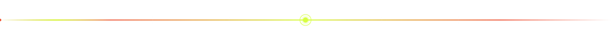

<!--
  Ahmed Ali Ghori — GitHub profile README
  ─────────────────────────────────────────────────────────────
  Artwork:  ./assets/hero.svg and ./assets/footer-motion.svg are animated SVGs
            committed to this repo — no external dependency, no build step.
  Palette:  ink #10100F · ember #EF4D2F · volt #D7FF3F · bone #F6F6F0 · ash #B8B8B0
            Every third-party card below is themed to that palette on purpose.
  Note:     github-readme-stats is deliberately NOT used here — its public
            deployment is frequently paused and renders as a broken image.
-->

  

  

  
  &nbsp;
  
  &nbsp;
  

  
  
  

---

## Two disciplines, one workflow

I design and build the surface **and** the intelligence underneath it. Most of my work sits where those two meet: a WebGL interface that has to feel effortless, wired to a retrieval pipeline or vision model that has to be correct.

<table>
<tr>
<td width="50%" valign="top">

### ◆ Creative engineering

Cinematic, motion-led interfaces where scroll, camera, and light are part of the argument — not decoration bolted on at the end.

WebGL scenes and shader work · smooth-scroll choreography · page transitions · responsive design systems · accessible motion

`Three.js` `React Three Fiber` `GSAP` `Lenis` `Next.js`

</td>
<td width="50%" valign="top">

### ◆ Applied AI

Prototypes that do real inference on real inputs — speech, documents, video frames — and stay honest about their confidence.

Retrieval-augmented generation · vector search · computer vision · speech-to-text · evaluation and guardrails

`Python` `FastAPI` `OpenCV` `RAG` `Vector DBs`

</td>
</tr>
</table>

---

## Stack

**Interface**

  
  
  
  
  
  
  
  
  

**Intelligence and services**

  
  
  
  
  
  
  
  

---

## Selected work

<table>
<tr>
<td width="50%" valign="top">

### 01 / Voice2Law

A bilingual (Urdu + English) legal-assistant system: speech intake, retrieval-augmented answers grounded in Pakistani statute text, drafting helpers, and case-timeline tooling — split across a Node API and a Python NLP service.

`RAG` `FastAPI` `TypeScript` `Speech-to-Text` `Docker`

[Repository →](https://github.com/AHMEDALIGHORI/Voice2Law-Website)

</td>
<td width="50%" valign="top">

### 02 / Webgel Studio

A 16-page creative studio experience where WebGL heroes, smooth-scroll choreography, page transitions, and grain-driven art direction work as one visual system.

`Three.js` `GSAP` `Lenis` `WebGL`

[Repository →](https://github.com/AHMEDALIGHORI/Webgel-Studio-WEBGEL)

</td>
</tr>
<tr>
<td width="50%" valign="top">

### 03 / PlantPot Studio

An explorable 3D portfolio built as a miniature world — React Three Fiber scenes, animated environments, orbit controls, and scene-led navigation instead of pages.

`Next.js` `React Three Fiber` `Drei` `TypeScript`

[Repository →](https://github.com/AHMEDALIGHORI/PlantPot)

</td>
<td width="50%" valign="top">

### 04 / Qitchen

A responsive restaurant experience shaped through cinematic food imagery, restrained typography, and motion that supports the dining narrative.

`HTML` `CSS` `Responsive UI` `Motion Design`

[Live site →](https://qitchen-animated-restaurant-website.vercel.app) · [Repository →](https://github.com/AHMEDALIGHORI/qitchen-animated-restaurant-website)

</td>
</tr>
</table>

<b>More from the lab</b> — experiments, AI prototypes, and interaction studies

 

| Project | What it is | Stack |
| :--- | :--- | :--- |
| **[FIFA World](https://github.com/AHMEDALIGHORI/FIFA-WORLD-WEBSITE-)** | A tactile World Cup sticker album with scratch-to-reveal cards, WebGL motion, and liquid-glass feedback. | `JavaScript` `WebGL` |
| **[Ahmed Ali Portfolio](https://ahmed-ali-portfolio-amber.vercel.app)** | Live motion portfolio with a video hero and scroll-directed storytelling. · [Source](https://github.com/AHMEDALIGHORI/ahmed-ali-portfolio) | `TypeScript` `GSAP` `hls.js` |
| **[VisionAI Pro](https://github.com/AHMEDALIGHORI/VisionAi-)** | Real-time computer-vision experiments: product recognition, gesture control, and sign-language input. | `Python` `OpenCV` |
| **[MindScope RAG](https://github.com/AHMEDALIGHORI/mindscope-emotion-screen-detection-rag)** | Emotion-screening and local retrieval-augmented QA prototype. | `React` `Flask` `OpenCV` |
| **[Noor Al-Huda](https://github.com/AHMEDALIGHORI/Noor-AL-Huda)** | AI-assisted Islamic knowledge platform with generated explanations. | `TypeScript` `Firebase` `Gemini` |

<b>Client work</b> — ten shipped healthcare practice sites

 

A production series of responsive clinic websites, each with its own information architecture, service taxonomy, and local-SEO structure — built to be handed over and maintained by non-technical staff.

[Glisten Dental](https://github.com/AHMEDALIGHORI/glisten-dental) ·
[Dentique](https://github.com/AHMEDALIGHORI/dentique-dental-clinics) ·
[The Dental Clinic](https://github.com/AHMEDALIGHORI/The-Dental-Clinic) ·
[GM Dental](https://github.com/AHMEDALIGHORI/gm-dental-clinic) ·
[Yasir Dental Care](https://github.com/AHMEDALIGHORI/yasir-dental-care) ·
[Patel Dental](https://github.com/AHMEDALIGHORI/patel-dental-clinic) ·
[The Care Medical Center](https://github.com/AHMEDALIGHORI/the-care-medical-center) ·
[Rajput Dental & Physio](https://github.com/AHMEDALIGHORI/rajput-dental-and-physio-clinic) ·
[Durrani's Dental](https://github.com/AHMEDALIGHORI/durranis-dental-clinic) ·
[Dental Works](https://github.com/AHMEDALIGHORI/dental-works)

---

## On GitHub

  
  
  

  

<b>Language breakdown and commit rhythm</b>

 

  
  

  

<!--
  Contribution snake: the workflow in .github/workflows/snake.yml generates
  dist/github-contribution-grid-snake.svg and pushes it to the `output` branch.
  It cannot run while GitHub Actions is blocked on this account, so the image
  is left commented out rather than shipped broken. Un-comment once a run
  succeeds and the `output` branch exists:

  

    
  

-->

---

## Let's make something memorable

Have a product that should feel as good as it works? I take on immersive websites, interactive portfolios, product launches, and AI-enabled prototypes — and I'm comfortable owning both the interface and the model behind it.

  
  &nbsp;
  

  

  Hero and footer artwork are hand-authored animated SVGs living in this repository — no image CDN, no build step.

