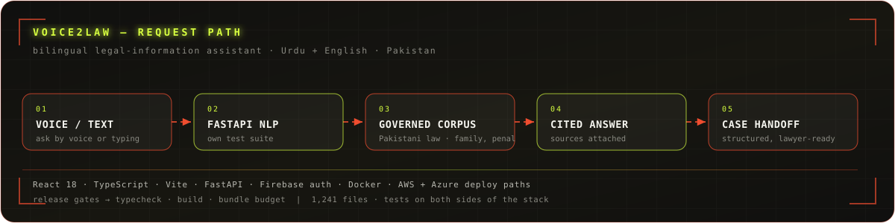
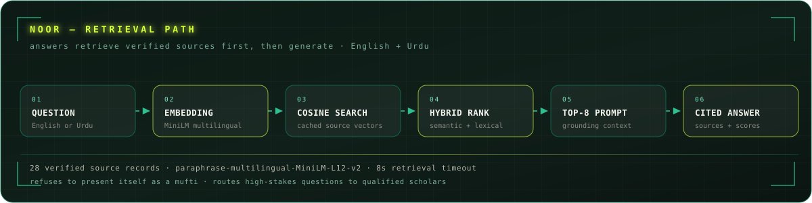

<!--
  Ahmed Ali Ghori — GitHub profile README
  ─────────────────────────────────────────────────────────────
  Palette:  ink #10100F · ember #EF4D2F · volt #D7FF3F · bone #F6F6F0 · ash #B8B8B0
  Design: visual, proof-dense, fast to scan.

  Custom assets (hand-authored, animated, rendered and checked before commit)
    assets/hero.svg             dark-theme banner
    assets/hero-light.svg       light-theme banner
    assets/arch-voice2law.svg   Voice2Law request path
    assets/arch-noor-rag.svg    Noor retrieval path
  Banners swap with the reader's GitHub theme via <picture> + prefers-color-scheme.

  Live widgets — every endpoint below was fetched and returns 200
    · shields.io badges (static, last-commit, license)
    · github-profile-summary-cards (theme=github / github_dark)
    · streak-stats.demolab.com
    · readme-typing-svg.demolab.com
    · skillicons.dev — checked icon by icon; an unknown slug renders an
      empty box, so only confirmed slugs appear. Not available:
      webgl, gsap, r3f, numpy, pandas, expo, reactnative — those live in
      the text-badge row instead.

  Deliberately excluded
    · github-readme-stats — public instance answers 503
    · github-readme-activity-graph — answers 402 Payment Required
    · github-profile-trophy — answers 402 Payment Required
    · komarev.com profile-views counter — returns 200 to a plain request but
      answers 404/504 intermittently through GitHub's camo image proxy,
      which is what actually serves README images. A flaky counter is worse
      than no counter, so that slot now carries a last-commit badge.
    · shields /github/public-repos and /dynamic/json for the API — the live
      summary cards already report repo counts, so a stale hand-maintained
      number was never worth the extra request.
    · CI badges — GitHub Actions cannot start jobs on this account (billing
      lock), so a workflow badge would only ever read "error".
-->

  <picture>
    <source media="(prefers-color-scheme: dark)" srcset="./assets/hero.svg">
    <source media="(prefers-color-scheme: light)" srcset="./assets/hero-light.svg">
    
  </picture>

  <picture>
    <source media="(prefers-color-scheme: dark)" srcset="https://readme-typing-svg.demolab.com?font=JetBrains+Mono&weight=600&size=21&pause=1000&color=D7FF3F&center=true&vCenter=true&width=880&height=46&lines=Immersive+frontend+%C3%97+applied+AI;Three.js+%C2%B7+R3F+%C2%B7+GSAP+%C2%B7+WebGL;RAG+%C2%B7+computer+vision+%C2%B7+FastAPI;Source-grounded+AI%2C+shipped+as+products">
    <source media="(prefers-color-scheme: light)" srcset="https://readme-typing-svg.demolab.com?font=JetBrains+Mono&weight=600&size=21&pause=1000&color=10100F&center=true&vCenter=true&width=880&height=46&lines=Immersive+frontend+%C3%97+applied+AI;Three.js+%C2%B7+R3F+%C2%B7+GSAP+%C2%B7+WebGL;RAG+%C2%B7+computer+vision+%C2%B7+FastAPI;Source-grounded+AI%2C+shipped+as+products">
    
  </picture>

  
  &nbsp;
  
  &nbsp;
  
  &nbsp;
  

  
  &nbsp;
  
  &nbsp;
  
  &nbsp;
  
  &nbsp;
  
  &nbsp;
  

---

## 🧭 The work

**Frontend developer and data analyst.** I build responsive web interfaces and turn raw data into something a person can act on — the two halves of the same job, and the reason my projects always pair an interface with the reasoning behind it.

**Everything here is open source and MIT licensed.** The projects below are real repositories, not case studies: what shipped, what it runs on, and how it is verified.

---

## 🚀 Flagship projects

| Project | What it does | Proof |
| --- | --- | --- |
| **[Voice2Law](https://github.com/AHMEDALIGHORI/Voice2Law-Website)** | Bilingual legal Q&A grounded in Pakistani case law, with citations and a lawyer-ready handoff | **1,241 files** · React 18 + FastAPI |
| **[Noor Islamic Companion](https://github.com/AHMEDALIGHORI/noor-islamic-companion)** | Retrieval-first Islamic answers that cite verified sources instead of inventing them | **28 verified records** · MIT |
| **[hf-rag-starter](https://github.com/AHMEDALIGHORI/hf-rag-starter)** | A RAG foundation small enough to read in one sitting | **one runtime dependency** · MIT |
| **[quran-api-client](https://github.com/AHMEDALIGHORI/quran-api-client)** | Talking to Al Quran Cloud without six dependencies | **zero runtime dependencies** · MIT |
| **[expo-audio-dock](https://github.com/AHMEDALIGHORI/expo-audio-dock)** | Audio that keeps playing while the user navigates | Reanimated · typed API |
| **[mindscope](https://github.com/AHMEDALIGHORI/mindscope-emotion-screen-detection-rag)** | Emotion screening with screen detection over a RAG pipeline | Python |

  
  &nbsp;
  
  &nbsp;
  

### 01 · Voice2Law — bilingual legal Q&A grounded in real Pakistani law

   

Ask a legal question in **Urdu or English**, by voice or text, and get an answer grounded in a **governed corpus of Pakistani law** with source citations — then export a structured, lawyer-ready case handoff.

- **Client** — React 18, TypeScript, Vite, Firebase auth, responsive and keyboard-accessible
- **Service** — FastAPI NLP service with its own test package
- **Quality gates** — `typecheck → build → bundle budget` scripted, tests on both sides of the stack, Dependabot PRs
- **Ship path** — Docker, PM2 auto-start, and documented AWS and Azure deployments

**Try it:** [Source](https://github.com/AHMEDALIGHORI/Voice2Law-Website)

### 02 · Noor Islamic Companion — answers that cite their sources

   

Most AI chatbots hallucinate religious citations. Noor retrieves **verified Quran, Hadith, and Tafsir passages first**, then generates only from what it retrieved — returning exact references, relevance scores, and retrieval metadata. It refuses to present itself as a mufti and routes high-stakes questions to qualified scholars.

- **Retrieval** — `paraphrase-multilingual-MiniLM-L12-v2` embeddings, cosine similarity over pre-cached sources, lexical fallback, hybrid ranking, 8-second retrieval timeout
- **Stack** — React Native + Expo Router, tRPC, Drizzle + MySQL, Zod, NativeWind, Hugging Face Inference Providers
- **Process** — source-contribution issue templates, source research notes, documented methodology

**Try it:** [Source](https://github.com/AHMEDALIGHORI/noor-islamic-companion)

---

## 🏗️ Architecture

Two request paths I designed end to end — drawn as plain SVG so they render everywhere, at any zoom, without a third-party service in the middle.

| Design decision | Why it holds |
| --- | --- |
| **Retrieve before generating** | Noor never writes a citation it has not retrieved, which is the difference between an answer and a guess. |
| **Sources as data, not prompts** | Keeping the corpus versioned and reviewable means a wrong claim is a data fix, not a prompt-engineering problem. |
| **Graceful degradation** | An 8-second retrieval timeout with a lexical fallback means a slow or missing embedding service still returns an answer. |
| **Bilingual from the first commit** | Urdu and English are handled in the type signatures and the schema, not bolted on by string replacement later. |

---

## 📈 Activity

Live numbers from the GitHub API — these widgets query my account every time this page loads, so they are never stale.

  <picture>
    <source media="(prefers-color-scheme: dark)" srcset="https://github-profile-summary-cards.vercel.app/api/cards/profile-details?username=AHMEDALIGHORI&theme=github_dark">
    <source media="(prefers-color-scheme: light)" srcset="https://github-profile-summary-cards.vercel.app/api/cards/profile-details?username=AHMEDALIGHORI&theme=github">
    
  </picture>

  <picture>
    <source media="(prefers-color-scheme: dark)" srcset="https://github-profile-summary-cards.vercel.app/api/cards/stats?username=AHMEDALIGHORI&theme=github_dark">
    <source media="(prefers-color-scheme: light)" srcset="https://github-profile-summary-cards.vercel.app/api/cards/stats?username=AHMEDALIGHORI&theme=github">
    
  </picture>
  &nbsp;&nbsp;
  <picture>
    <source media="(prefers-color-scheme: dark)" srcset="https://github-profile-summary-cards.vercel.app/api/cards/repos-per-language?username=AHMEDALIGHORI&theme=github_dark">
    <source media="(prefers-color-scheme: light)" srcset="https://github-profile-summary-cards.vercel.app/api/cards/repos-per-language?username=AHMEDALIGHORI&theme=github">
    
  </picture>
  &nbsp;&nbsp;
  <picture>
    <source media="(prefers-color-scheme: dark)" srcset="https://github-profile-summary-cards.vercel.app/api/cards/most-commit-language?username=AHMEDALIGHORI&theme=github_dark">
    <source media="(prefers-color-scheme: light)" srcset="https://github-profile-summary-cards.vercel.app/api/cards/most-commit-language?username=AHMEDALIGHORI&theme=github">
    
  </picture>

  <picture>
    <source media="(prefers-color-scheme: dark)" srcset="https://streak-stats.demolab.com?user=AHMEDALIGHORI&theme=github-dark&hide_border=true">
    <source media="(prefers-color-scheme: light)" srcset="https://streak-stats.demolab.com?user=AHMEDALIGHORI&theme=github&hide_border=true">
    
  </picture>

These are live cards, not cached numbers — they are fetched from the GitHub API every time this page loads, so they will never quietly go out of date.

---

## 🧰 Toolbox

**Also in the stack:** GSAP · R3F · WebGL · React Native · Expo Router · Reanimated · tRPC · Drizzle · Zod · NativeWind · Hugging Face · NumPy · pandas · PyTorch · CLIP · Vitest

| Area | Detail |
| --- | --- |
| **Frontend** | React · Next.js · TypeScript · Three.js · GSAP · Tailwind · accessibility and keyboard support |
| **Applied AI** | RAG · multilingual embeddings · hybrid retrieval · Hugging Face inference · source-grounded generation |
| **Backend & data** | FastAPI · Node.js · PostgreSQL · MySQL · Drizzle · Firebase · data analysis and reporting |
| **Mobile** | React Native · Expo Router · Reanimated · persistent audio and gesture-driven UI |
| **Engineering** | Vite · Vitest · Docker · GitHub Actions · bundle budgets and scripted quality gates |

---

## 🧠 How I work

- **Evidence over assertion.** A tool that cannot show why it produced an answer is not finished. Every claim carries the passage it came from.
- **Retrieve before generating.** A citation that was not retrieved is a guess wearing a footnote. The corpus comes first, the model second.
- **Build the boring parts properly.** Typed responses, tests on both sides of the stack, and a scripted `typecheck → build → bundle budget` gate, because that is what keeps a project maintainable after the demo.
- **Ship the whole path.** Docker, documented deploys, and an accessible keyboard-navigable interface — a feature nobody can install is not a feature.
- **Open by default.** MIT licensing, documented methodology, and contribution templates, so the work outlives the person who wrote it.

**Focus:** retrieval-grounded AI · bilingual NLP · immersive frontend · developer tools that are small enough to read in one sitting.

---

## 🤝 Let's build

Open to **frontend**, **full-stack**, and **applied AI** roles — and to collaborations with **founders shipping AI products** and **open-source maintainers** in the developer-tools space.

If you are building something that has to be right rather than merely impressive — a grounded answer, a bilingual interface, a product that people actually use — I'd like to hear about it.

  
  &nbsp;
  
  &nbsp;
  

  

