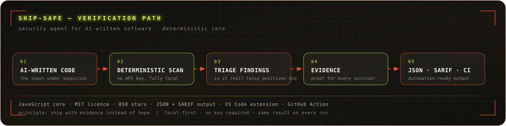
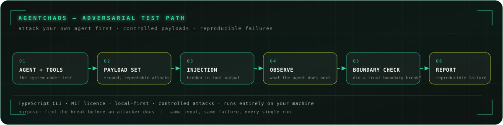

<!--
  Alhassane Samassekou — GitHub profile README
  ─────────────────────────────────────────────────────────────
  Palette:  ink #10100F · ember #EF4D2F · volt #D7FF3F · bone #F6F6F0 · ash #B8B8B0
  Design: visual, proof-dense, fast to scan.

  Custom assets (hand-authored, animated, rendered and checked before commit)
    assets/hero.svg             dark-theme banner
    assets/hero-light.svg       light-theme banner
    assets/arch-shipsafe.svg    ship-safe verification path
    assets/arch-agentchaos.svg  AgentChaos adversarial test path
  Banners swap with the reader's GitHub theme via <picture> + prefers-color-scheme.

  Live widgets — every endpoint below was fetched and returns 200
    · shields.io badges (static, dynamic/github, last-commit, license)
    · github-profile-summary-cards (theme=github / github_dark)
    · streak-stats.demolab.com
    · readme-typing-svg.demolab.com
    · skillicons.dev — checked icon by icon; an unknown slug renders an
      empty box, so only confirmed slugs appear. Not available:
      numpy, pandas, chromedevtools, electronjs, v3 — those live in the
      text-badge row instead.

  Deliberately excluded
    · github-readme-stats — public instance answers 503
    · github-readme-activity-graph — answers 402 Payment Required
    · github-profile-trophy — answers 402 Payment Required
    · komarev.com profile-views counter — returns 200 to a plain request but
      answers 404/504 intermittently through GitHub's camo image proxy,
      which is what actually serves README images. A flaky counter is worse
      than no counter, so that slot now carries a last-commit badge.
    · shields /github/public-repos and /dynamic/json for the API — the live
      summary cards already report repo counts, so a stale hand-maintained
      number was never worth the extra request.
-->

  <picture>
    <source media="(prefers-color-scheme: dark)" srcset="./assets/hero.svg">
    <source media="(prefers-color-scheme: light)" srcset="./assets/hero-light.svg">
    
  </picture>

  <picture>
    <source media="(prefers-color-scheme: dark)" srcset="https://readme-typing-svg.demolab.com?font=JetBrains+Mono&weight=600&size=21&pause=1000&color=D7FF3F&center=true&vCenter=true&width=880&height=46&lines=Full-Stack+AI+Engineer+%C2%B7+Founder+of+ship-safe;Local-first+security+for+AI-written+code;Deterministic+analysis+%C2%B7+SARIF+%C2%B7+no+API+key;Adversarial+agent+testing%2C+reproducible">
    <source media="(prefers-color-scheme: light)" srcset="https://readme-typing-svg.demolab.com?font=JetBrains+Mono&weight=600&size=21&pause=1000&color=10100F&center=true&vCenter=true&width=880&height=46&lines=Full-Stack+AI+Engineer+%C2%B7+Founder+of+ship-safe;Local-first+security+for+AI-written+code;Deterministic+analysis+%C2%B7+SARIF+%C2%B7+no+API+key;Adversarial+agent+testing%2C+reproducible">
    
  </picture>

  
  &nbsp;
  
  &nbsp;
  
  &nbsp;
  

  
  &nbsp;
  
  &nbsp;
  
  &nbsp;
  
  &nbsp;
  
  &nbsp;
  

---

## 🛡️ The mission

AI agents have become software collaborators. Their output deserves the same rigor as any other production dependency — and right now it usually gets less.

**ship-safe** is my answer to that gap: a local-first security agent for AI-written software that finds issues, checks whether they are actually real, and returns evidence instead of a wall of warnings. **AgentChaos** covers the other half — attacking your own agent before somebody else finds the gap.

**Everything here is local-first and open source.** No API key, no telemetry, no data leaving your machine. If a security tool needs a vendor's servers to tell you whether you're secure, it isn't the tool you wanted.

---

## 🚀 Flagship projects

| Project | What it does | Proof |
| --- | --- | --- |
| **[ship-safe](https://github.com/asamassekou10/ship-safe)** | Independent security agent for AI-written software — deterministic core, no API key, JSON and SARIF output | [★ 850](https://github.com/asamassekou10/ship-safe) · [MIT](https://github.com/asamassekou10/ship-safe) |
| **[AgentChaos](https://github.com/asamassekou10/AgentChaos)** | Local-first CLI that injects controlled attacks into agent tool responses and verifies security boundaries | [TypeScript](https://github.com/asamassekou10/AgentChaos) · [MIT](https://github.com/asamassekou10/AgentChaos) |
| **[ship-safe-vscode](https://github.com/asamassekou10/ship-safe-vscode)** | VS Code extension putting the verification loop inside the editor | [TypeScript](https://github.com/asamassekou10/ship-safe-vscode) |
| **[demo-gitskins](https://github.com/asamassekou10/demo-gitskins)** | Premium profile READMEs built entirely from live GitSkins sections — animated, no committed assets | [★ 15](https://github.com/asamassekou10/demo-gitskins) · [gitskins.com](https://www.gitskins.com) |
| **[Vector-Search](https://github.com/asamassekou10/Vector-Search)** | Multi-modal CLIP + vector search across a 44,000-item catalogue — text-to-image and image-to-image | [Notebook](https://github.com/asamassekou10/Vector-Search) |
| **[AgentOrchestrator](https://github.com/asamassekou10/AgentOrchestrator)** | Orchestration experiments for multi-agent workflows | [Python](https://github.com/asamassekou10/AgentOrchestrator) |

  
  &nbsp;
  
  &nbsp;
  

### 01 · ship-safe — the independent security agent for AI-written software

   

A security agent for the AI software supply chain. It **finds issues**, **investigates whether they are real**, and **shows you the evidence** — because a scanner that hands you 400 unverified warnings has not solved anything.

- **Deterministic core, no API key.** The same input produces the same verdict on every run, on your machine, with nothing sent to a vendor.
- **False positives get killed.** Findings are triaged before they reach you, so what survives is worth reading.
- **Automation-ready output.** JSON for tooling, SARIF for code scanning and CI, so security becomes a gate rather than a report nobody opens.

**Try it:** [shipsafe.sh](https://shipsafe.sh) · [Source](https://github.com/asamassekou10/ship-safe) · [VS Code extension](https://github.com/asamassekou10/ship-safe-vscode)

### 02 · AgentChaos — safely attack your AI agent

 

A local-first security-testing CLI that injects controlled attacks into agent tool responses, then verifies whether the agent's security boundaries actually held.

- **Controlled payloads.** Scoped attacks, not random fuzzing — each run is deliberate and repeatable.
- **Watches what happens next.** The interesting part is not the injection but the agent's *next action*.
- **Reproducible failures.** Same input, same break, every time — so a bug report is a test case.

**Try it:** [Source](https://github.com/asamassekou10/AgentChaos) · part of the ship-safe security stack

---

## 🏗️ Architecture

Two request paths, drawn to end — the tools are small, the reasoning is explicit, and every stage is inspectable.

| Design decision | Why it holds |
| --- | --- |
| **Deterministic over probabilistic** | The analysis core runs without a model in the loop, so a verdict is explainable and repeatable. |
| **Local-first by default** | Code never leaves the machine. For security tooling that is not a feature request, it is table stakes. |
| **Evidence attached to findings** | Every reported issue carries the reasoning behind it, so a developer can accept or reject it quickly. |
| **SARIF at the boundary** | Emitting a standard format means the output drops into existing CI and code scanning with no glue code. |

---

## 📈 Activity

Live numbers from the GitHub API — these widgets query my account every time this page loads, so they are never stale.

  <picture>
    <source media="(prefers-color-scheme: dark)" srcset="https://github-profile-summary-cards.vercel.app/api/cards/profile-details?username=asamassekou10&theme=github_dark">
    <source media="(prefers-color-scheme: light)" srcset="https://github-profile-summary-cards.vercel.app/api/cards/profile-details?username=asamassekou10&theme=github">
    
  </picture>

  <picture>
    <source media="(prefers-color-scheme: dark)" srcset="https://github-profile-summary-cards.vercel.app/api/cards/stats?username=asamassekou10&theme=github_dark">
    <source media="(prefers-color-scheme: light)" srcset="https://github-profile-summary-cards.vercel.app/api/cards/stats?username=asamassekou10&theme=github">
    
  </picture>
  &nbsp;&nbsp;
  <picture>
    <source media="(prefers-color-scheme: dark)" srcset="https://github-profile-summary-cards.vercel.app/api/cards/repos-per-language?username=asamassekou10&theme=github_dark">
    <source media="(prefers-color-scheme: light)" srcset="https://github-profile-summary-cards.vercel.app/api/cards/repos-per-language?username=asamassekou10&theme=github">
    
  </picture>
  &nbsp;&nbsp;
  <picture>
    <source media="(prefers-color-scheme: dark)" srcset="https://github-profile-summary-cards.vercel.app/api/cards/most-commit-language?username=asamassekou10&theme=github_dark">
    <source media="(prefers-color-scheme: light)" srcset="https://github-profile-summary-cards.vercel.app/api/cards/most-commit-language?username=asamassekou10&theme=github">
    
  </picture>

  <picture>
    <source media="(prefers-color-scheme: dark)" srcset="https://streak-stats.demolab.com?user=asamassekou10&theme=github-dark&hide_border=true">
    <source media="(prefers-color-scheme: light)" srcset="https://streak-stats.demolab.com?user=asamassekou10&theme=github&hide_border=true">
    
  </picture>

These are live cards, not cached numbers — they are fetched from the GitHub API every time this page loads, so they will never quietly go out of date.

---

## 🧰 Toolbox

**Also in the stack:** NumPy · pandas · PyTorch · CLIP · Jupyter · Chrome Extensions · SARIF · MCP · Bash

| Area | Detail |
| --- | --- |
| **AI agent security** | Adversarial testing · trust boundaries · tool-response injection · reproducible failure harnesses |
| **Security analysis** | Static analysis · finding triage · SARIF emission · supply-chain risk |
| **Product engineering** | TypeScript · Node.js · Python · CLI tooling · VS Code extensions · GitHub Actions |
| **Interfaces & infra** | React · Next.js · HTML/CSS · PostgreSQL · Prisma · Docker · Vercel · Linux |

---

## 🧠 How I work

- **Evidence over assertion.** A security tool that cannot show why it flagged something is not finished. Every finding carries its reasoning.
- **Local-first, always.** No API key, no vendor round-trip, no data leaving the machine. It has to work on a plane, in CI, and on a laptop.
- **Deterministic where it counts.** The analysis core avoids probabilistic steps so results are reproducible and a bug report doubles as a test case.
- **Standard formats at the edges.** JSON and SARIF out, so the tools drop into pipelines people already run instead of demanding new glue.
- **Adversarial by habit.** Break your own system before somebody else does, then write down exactly how it broke.

**Open-source focus:** agent security tooling · supply-chain scanning · deterministic analysis · local-first developer tools · extensions and CLIs that respect the user's machine.

---

## 🤝 Let's build safer AI software

I'm interested in collaborating with **founders shipping AI products**, **security engineers** working on agent trust, and **open-source maintainers** in the developer-tools space.

If you're putting agents in front of real users and want the same evidence-first rigor that ship-safe brings to code — I'd like to hear about it.

  
  &nbsp;
  
  &nbsp;
  

  

